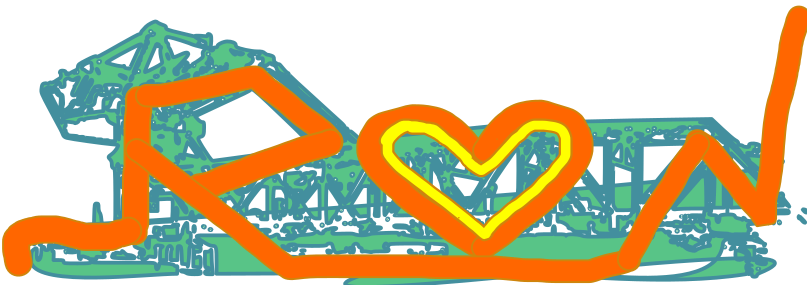

# Rustbelt Digital Network
Welcome to our GitHub organization for the Rustbelt Digital Network! 
We are a group of people in the general vicinity of Lake Erie and the Great Lakes (an epicenter of the "rust belt") who care about digital arts and digital humanities and related projects as they uplift our region. 
This project exists to be a social connector and repository of shared information about people, places, events, and projects in our region. 

*Photo credit: [Gregory H. Bondar](https://github.com/ghbondar)'s photo of the bascule bridge in Ashtabula, Ohio.

* Our site logo (until one of us makes a better one!), created by [Elisa Beshero-Bondar](https://github.com/ebeshero) with Inkscape starting from Gregory Bondar's photo.

# 🚧 
This repository supports a website that our members can help to build. To help out in this space, you will [need a GitHub account](https://docs.github.com/en/account-and-profile/how-tos/account-management/creating-an-account-on-github). 
(We'll post some instructions when we're ready!)

