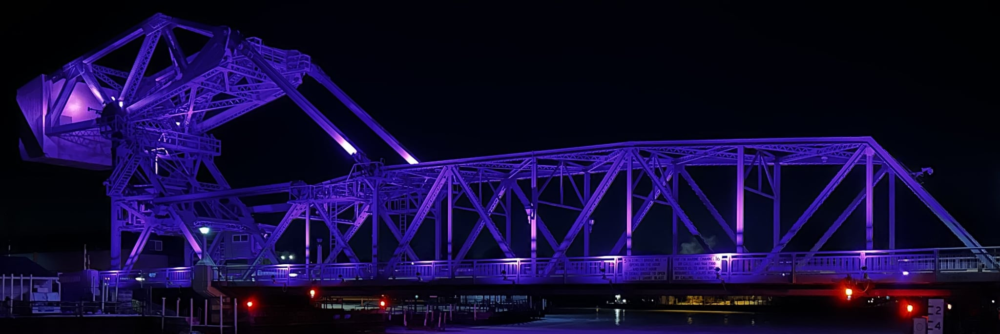

# Image credits

* We created our logo from Gregory Bondar’s photo of the Ashtabula lift bridge (West Fifth Street Bridge in Ashtabula, Ohio), stored here as .

This is a basule bridge (a movable drawbridge over waterways that lifts up to permit tall-masted boats to pass underneath). The bascule bridge makes a nice symbol of connectedness and our region near Lake Erie. . 
* We began experimenting with creating images for our site wtih this photo found on the internet: Ashtabula-OH-bascule-bridge-night.jpg: Source: <https://www.noshoesjusttravel.com/getaway-weekend-in-ashtabula-historic-harbor-on-lake-erie-things-to-do/>
© 2020 No Shoes Just Travel. This photo served as a basis for experimenting with tracing the form of Ashtabula's bascule bridge in the software Inkscape. We opted not to use this image as the basis for our logo due to the complexity of the reflections, but we preserved some SVG files filtered from it here for decorating the site. 

 

